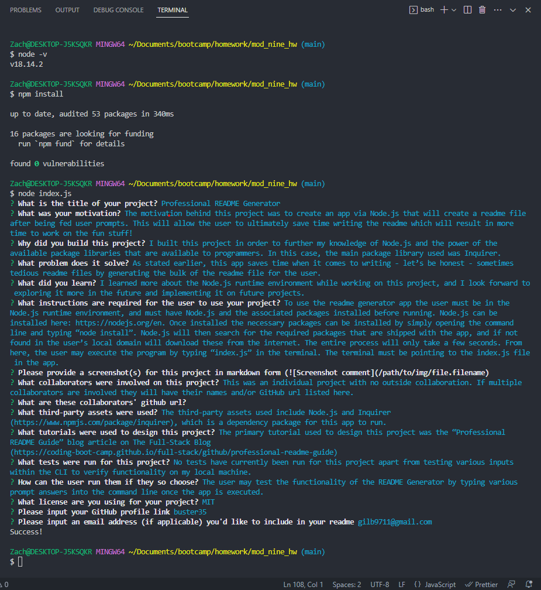
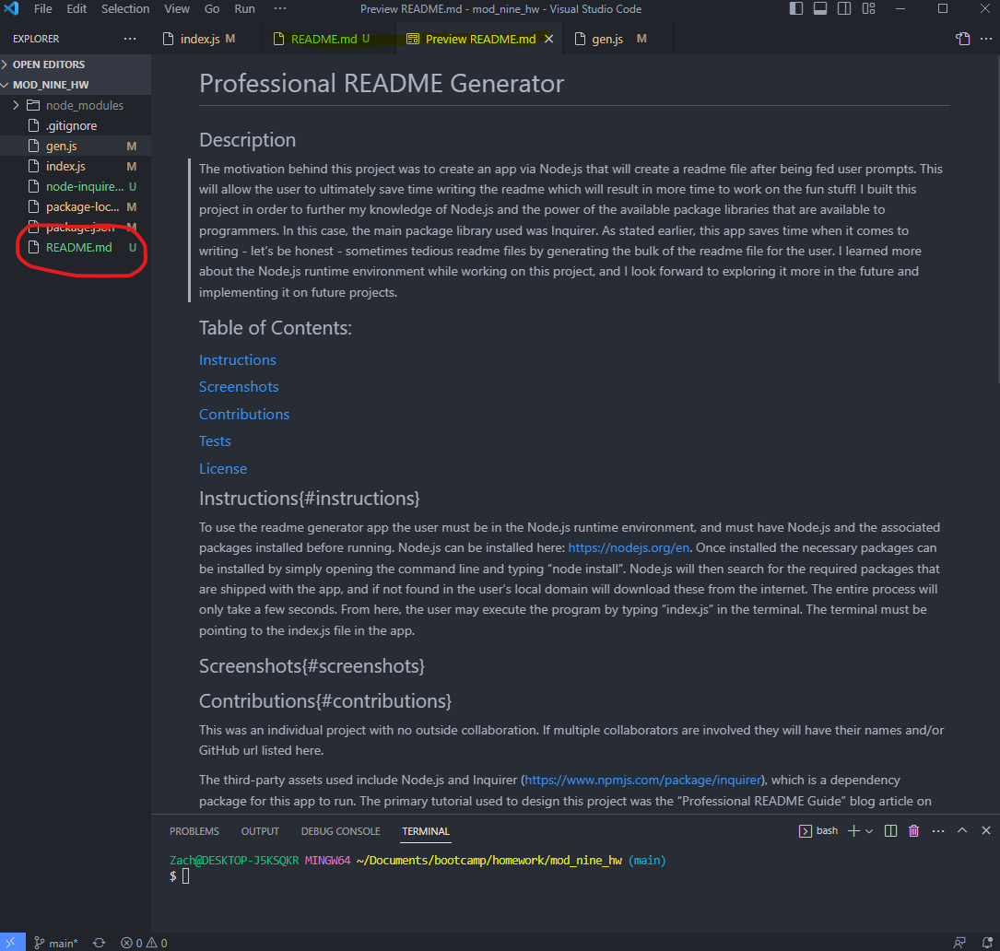

# Professional README Generator

## Description
This README file was created from the command line. The motivation behind this project was to create an app via Node.js that will create a readme file after being fed user prompts. This will allow the user to ultimately save time writing the readme which will result in more time to work on the fun stuff!
I built this project in order to further my knowledge of Node.js and the power of the available package libraries that are available to programmers. In this case, the main package library used was Inquirer: https://www.npmjs.com/package/inquirer#installation.
As stated earlier, this app saves time when it comes to writing - let’s be honest - sometimes tedious readme files by generating the bulk of the readme file for the user.
I learned more about the Node.js runtime environment while working on this project, and I look forward to exploring it more in the future and implementing it on future projects.
## Table of Contents
### [Installation](#installation)
### [Usage](#usage)
### [Screenshots](#screenshots)
### [Contributions](#contributions)
### [Tests](#tests)
### [Questions](#questions)
### [License](#license)
## Installation
To use the readme generator app the user must be in the Node.js runtime environment, and must have Node.js and the associated packages installed before running. Node.js can be installed here: https://nodejs.org/en. Once installed the necessary packages can be installed by simply opening the command line and typing “npm install”. Node.js will then search for the required packages that are shipped with the app, and if not found in the user’s local domain will download these from the internet. The entire process will only take a few seconds.
## Usage
The user may execute the program by typing “index.js” in the terminal. The terminal must be pointing to the index.js file in the app. From here the stream of question prompts will begin. The user will answer these within the command line. Answers to the prompts may be as long or as short as the user wants, but please pay close attention to any specific text formats that must be included for use with Markdown syntax. If the user chooses they may skip over a question by simply pressing enter to pass through the question once prompted.”\n”Once Inquirer finishes prompting the user a “README.md” file will be generated in the user’s directory and may be viewed as a raw Markdown file, or with the “Open Preview” (Ctrl + Shift + V) option when the README.md tab is right-clicked on while open in VSCode.
## Screenshots

## Contributions
This was an individual project with no outside collaboration. If multiple collaborators are involved they will have their names and/or GitHub url listed here.

The third-party assets used include Node.js and Inquirer (https://www.npmjs.com/package/inquirer), which is a dependency package for this app to run.
The primary tutorial used to design this project was the “Professional README Guide” blog article on The Full-Stack Blog (https://coding-boot-camp.github.io/full-stack/github/professional-readme-guide)
## Tests
No tests have currently been run for this project apart from testing various inputs within the CLI to verify functionality on my local machine.
The user may test the functionality of the README Generator by typing various prompt answers into the command line once the app is executed.
## Questions
Please direct any further questions to: buster35 or gilb9711@gmail.com.
## License
The license used for this project is MIT: https://choosealicense.com/licenses/mit/#.
